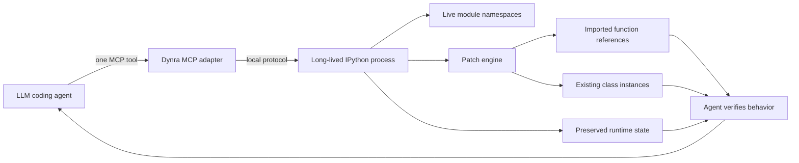

<p align="center">
  
</p>

<p align="center">
  <strong>Live Python runtime for LLM coding agents.</strong><br>
  Inspect, patch, and verify running software without restarting the process or losing its state.
</p>

<p align="center">
  <code>Python 3.10+</code> · <code>Model Context Protocol</code> · <code>State-preserving patches</code> · <code>IPython runtime</code>
</p>

## Give coding agents a live Python process

Most coding agents work indirectly: edit files, restart Python, reconstruct fixtures, reproduce the bug, and repeat. Every restart discards useful runtime context—loaded data, object graphs, caches, active sessions, and the exact state that exposed a failure.

Dynra gives an LLM coding agent a persistent Python runtime it can operate through MCP:

1. **Inspect** live modules, objects, and behavior.
2. **Patch** a function or class inside its owning module.
3. **Verify** the change against the already-running scenario.
4. **Iterate** without rebuilding state after every hypothesis.

Dynra is not a file watcher that restarts Python. It is a **state-preserving live programming runtime built for agentic development**.



## Agent quick start

Clone and start the trusted local runtime:

```bash
git clone https://github.com/antlobach/Dynra.git
cd Dynra
uv sync
uv run dynra
```

Configure Dynra in an MCP-compatible coding agent, replacing the path with your clone:

```json
{
  "mcpServers": {
    "dynra": {
      "command": "uv",
      "args": [
        "--directory",
        "/absolute/path/to/Dynra",
        "run",
        "python",
        "dynra_mcp.py"
      ]
    }
  }
}
```

The MCP adapter connects to the running process at `127.0.0.1:9999`.

## One MCP tool

Dynra exposes one general interface:

```text
dynra_repl(code, module="user")
```

The agent uses the same tool to inspect state, reproduce behavior, redefine functions or classes, and verify results. `module` makes namespace selection atomic, so calls never depend on a previously selected module. The response is structured with `success`, `module`, `result`, `stdout`, `stderr`, and `error`.

## A complete agent live-coding loop

Assume an agent is debugging pricing behavior. It creates a live library module:

```text
dynra_repl(
  module="pricing",
  code="def price(sku):\n    return {'book': 20}[sku]"
)
```

It creates a consumer with state and an imported function reference:

```text
dynra_repl(
  module="checkout",
  code="from pricing import price\ncart = ['book']\ndef total():\n    return sum(price(sku) for sku in cart)"
)

dynra_repl(module="checkout", code="total()")
# result: "20"
```

The agent patches only the behavior it is investigating:

```text
dynra_repl(
  module="pricing",
  code="def price(sku):\n    return {'book': 25}[sku]"
)
```

Then it verifies the already-running scenario:

```text
dynra_repl(module="checkout", code="total(), cart")
# result: "(25, ['book'])"
```

`checkout.price` was imported before the edit, but Dynra updated that existing function reference. The cart and its surrounding runtime stayed alive. The agent tested a hypothesis without recreating the process.

## Why this helps LLM agents

- **Less setup repetition:** expensive datasets, fixtures, and application state remain loaded.
- **Faster hypothesis loops:** one REPL tool handles inspection, patches, and verification.
- **Better runtime grounding:** the agent observes actual objects and behavior instead of inferring everything from source.
- **Stateful debugging:** failures that emerge after many transitions can remain reproduced while logic changes.
- **Smaller changes:** an agent can patch one definition, verify it, and only then persist the proven source edit.
- **Cross-module fidelity:** previously imported function references receive compatible live updates.

A useful agent operating pattern is:

```text
inspect live state -> reproduce failure -> patch owning module
-> verify observable behavior -> persist proven source change
```

Dynra is a runtime laboratory, not a replacement for source control or tests. A successful live patch proves behavior in the current process; the agent should still write the final source change and run the relevant durable checks.

## Runtime model

- One long-lived IPython process owns the live state.
- `md(name)` creates or returns a module namespace.
- `in_md(name)` imports or creates a module and makes it active.
- Function redefinitions update compatible imported function objects in place.
- Class redefinitions update compatible methods and class attributes.
- Existing instances can migrate state through `__dynra_update__`.
- Safe class mode refuses known-incompatible metaclass, base-class, and `__slots__` changes.

## Class evolution

An agent can include an instance migration hook when a new definition needs additional state:

```python
class Session:
    def __init__(self, user):
        self.user = user

    def label(self):
        return f"{self.user}:{self.status}"

    def __dynra_update__(self):
        if not hasattr(self, "status"):
            self.status = "active"
```

After a compatible patch, existing `Session` instances receive the new method and run `__dynra_update__`.

## Human interfaces

The agent workflow is the primary interface. Dynra also includes:

- `dynra_client.py` for one-off terminal evaluations.
- `dynra.el` for CIDER-inspired Emacs interaction.
- `dynra_extension.py` for IPython/Jupyter integration.
- A direct interactive REPL through `uv run dynra`.

Runtime commands:

| Command | Purpose |
| --- | --- |
| `md(name)` | Create or return a REPL module without entering it. |
| `in_md(name)` | Import or create a module, then make it active. |
| `ls_md()` | List live REPL and project modules. |
| `dir_md(module=None)` | List public symbols. |
| `doc(obj)` | Show documentation. |
| `source(obj)` | Show source when available. |
| `find_var(pattern)` | Search loaded modules for matching symbol names. |
| `class_patch_mode(mode=None)` | Read or set `safe` / `permissive` class patching. |
| `help_dynra()` | Show runtime help. |

Send terminal evaluations from a second shell:

```bash
uv run python dynra_client.py "1 + 1"
uv run python dynra_client.py -f path/to/change.py
```

## Current status and safety

Dynra is experimental. It executes arbitrary Python by design and is intended only for trusted local development. Do not expose its TCP port to untrusted users or networks, and do not let untrusted agents access the MCP server.

Some changes cannot be made safely in place. Process configuration, native extension state, incompatible closure layouts, and side effects outside Python memory may require a restart. Safe class mode rejects known incompatible class-shape changes rather than pretending they worked.

## License

Dynra is licensed under the [Apache License 2.0](LICENSE).
